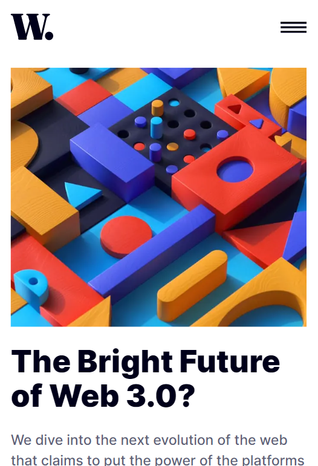
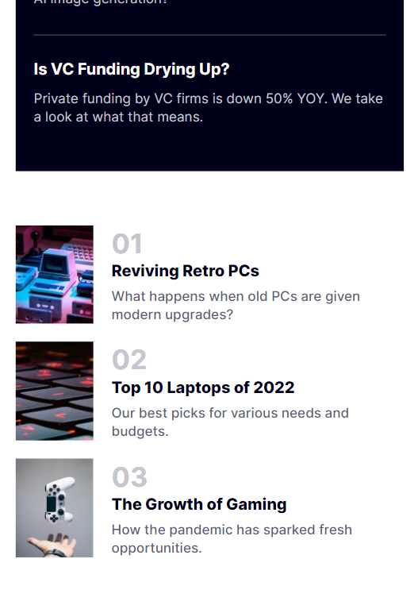
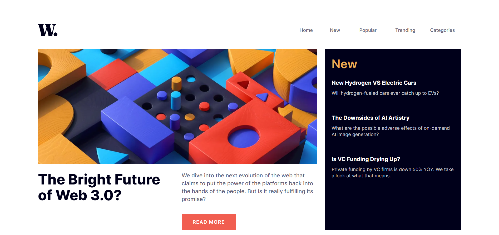
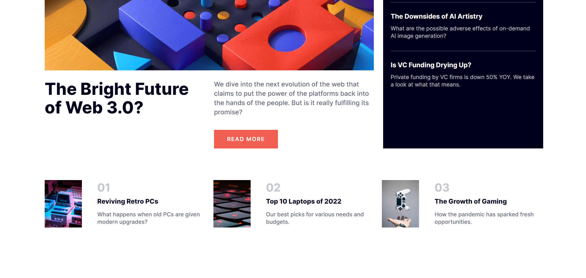

# Frontend Mentor - News homepage solution

This is a solution to the [News homepage challenge on Frontend Mentor](https://www.frontendmentor.io/challenges/news-homepage-H6SWTa1MFl). Frontend Mentor challenges help you improve your coding skills by building realistic projects.

## Table of contents

- [Overview](#overview)
  - [The challenge](#the-challenge)
  - [Screenshots](#screenshots)
  - [Links](#links)
- [Built with](#built-with)
- [Author](#author)

## Overview

### The challenge

Users should be able to:

- View the optimal layout for the interface depending on their device's screen size
- See hover and focus states for all interactive elements on the page

### Screenshots

#### Mobile

#### Desktop

### Links

- Live Site URL: [NewsHomepage](https://newshomepage-ruby.vercel.app/)

## Built with

- [Next.js](https://nextjs.org/) - React framework
- [TailwindCSS](https://tailwindcss.com/) - CSS Framework
- CSS Grid
- Mobile-first workflow

## Author

- Name - Pratik Bhangire (pratikbhangire@gmail.com)
- Frontend Mentor - [@pratikbhangire123](https://www.frontendmentor.io/profile/pratikbhangire123)
- Twitter - [@PratikBhangire](https://www.twitter.com/PratikBhangire)
